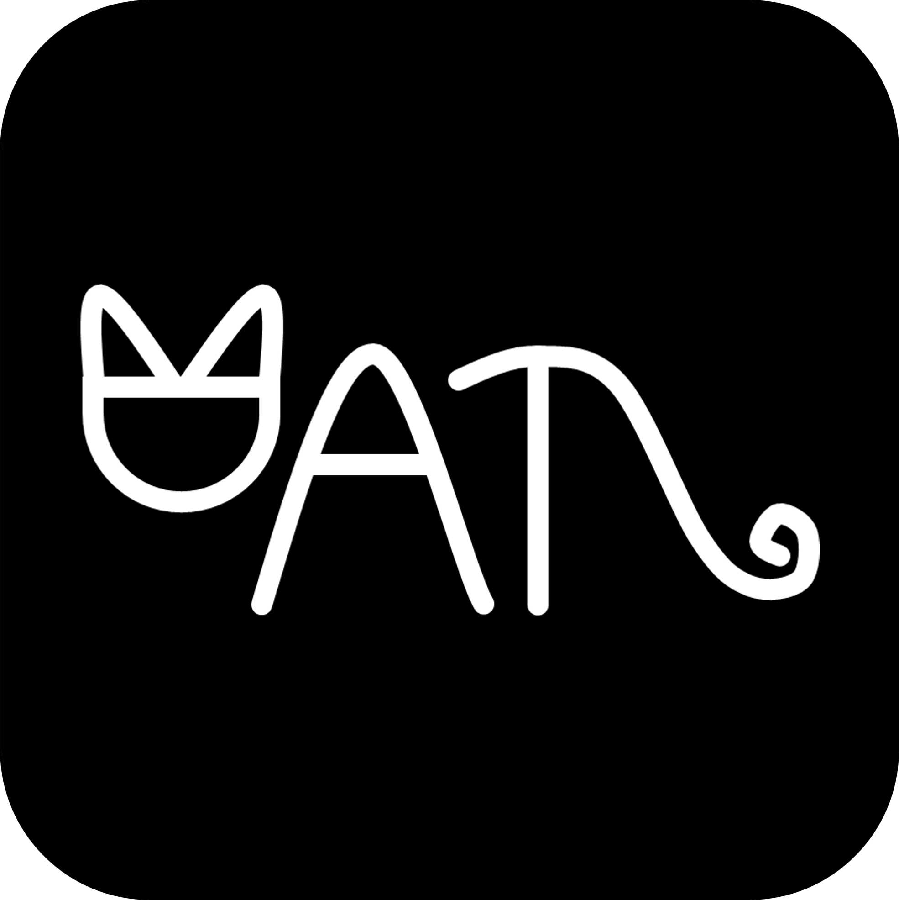
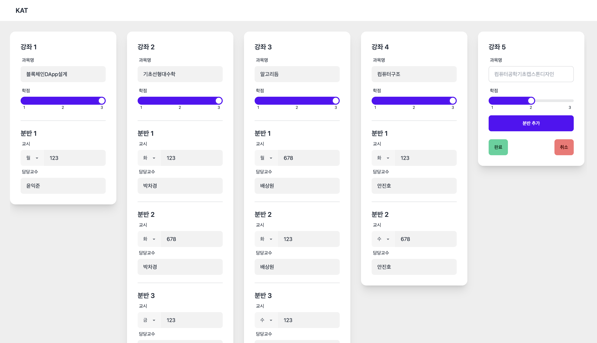

<h1 align="center">
  <br>
  <a href="https://kat-kgu.com/"></a>
  <br>
  KAT
  <br>
</h1>

<h4 align="center">Kyonggi University Automatic Timetable Generator - V2</h4>

<p align="center">
  <a href="https://gitter.im/wontory/kat-v2"></a>
  <a href="https://saythanks.io/to/devwontory">
      
  </a>
  <a href="https://www.paypal.me/wontory">
    
  </a>
</p>

<p align="center">
  <a href="#key-features">Key Features</a> •
  <a href="#how-to-use">How To Use</a> •
  <a href="#download">Download</a> •
  <a href="#credits">Credits</a> •
  <a href="#related">Related</a> •
  <a href="#license">License</a>
</p>

[](https://kat-kgu.com/)

## Key Features

- ClassSchedules - Create all possible timetables

## How To Use

To clone and run this application, you'll need [Git](https://git-scm.com) and [Node.js](https://nodejs.org/en/download/) (which comes with [npm](http://npmjs.com)) installed on your computer. From your command line:

```bash
# Clone this repository
$ git clone https://github.com/wontory/KAT-V2

# Install dependencies
$ yarn install

# Run the app
$ yarn start
```

> **Note**
> If you're using Linux Bash for Windows, [see this guide](https://www.howtogeek.com/261575/how-to-run-graphical-linux-desktop-applications-from-windows-10s-bash-shell/) or use `node` from the command prompt.

## Download

You can [download](https://github.com/wontory/KAT-V2/releases/tag/beta) the latest installable version of KAT-V2 for Windows, macOS and Linux.

## Emailware

KAT-V2 is an [emailware](https://en.wiktionary.org/wiki/emailware). Meaning, if you liked using this app or it has helped you in any way, I'd like you send me an email at <devwontory@gmail.com> about anything you'd want to say about this software. I'd really appreciate it!

## Credits

This software uses the following open source packages:

- [Node.js](https://nodejs.org/)
- [React.js](https://react.dev/)
- [Tailwind CSS](https://tailwindcss.com/)
- [daisyUI](https://daisyui.com/)
- [SweetAlert2](https://sweetalert2.github.io/)

## Related

[KAT](https://github.com/wontory/KAT) - Previous version of KAT

## Support

<a href="https://www.buymeacoffee.com/wontory" target="_blank"></a>

<p>Or</p>

<a href="https://www.patreon.com/wontory">
	
</a>

## License

GNU General Public License v3.0

---

> [wontory.github.io](https://wontory.github.io/profile/) &nbsp;&middot;&nbsp;
> GitHub [@wontory](https://github.com/wontory) &nbsp;&middot;&nbsp;
> Instagram [@jo_saeng](https://www.instagram.com/jo_saeng/)
